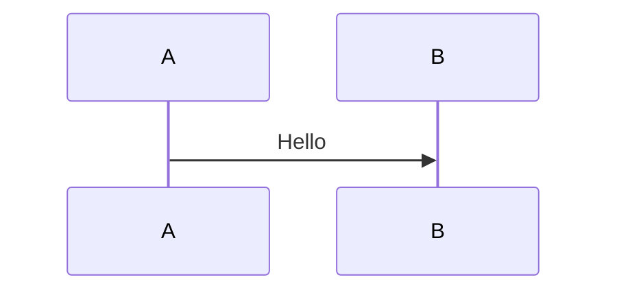

# Diagen — Diagram Generation Skill

Generate diagram source files and rendered images (SVG/PNG) from PlantUML, Mermaid, and Graphviz markup. Extract from markdown or render standalone files.

**Priority:** Every diagram must have clear, traceable lines between components. Connections are the primary information — boxes are secondary.

**Triggers:** "render diagram", "extract diagrams", "generate svg", "render puml", "render mermaid", "diagram to svg", "extract and render", "diagen"

---

## 1. Traceability Rules — Connection Clarity

Every diagram produced by this skill must prioritize readable, traceable connections between components. These rules apply across all diagram engines and categories.

### Universal Connection Principles

1. **Lines must be unambiguous** — every connection has a clear source, target, and direction
2. **Label all non-obvious edges** — if a line's purpose isn't self-evident from context, label it
3. **Minimize crossings** — reorder nodes, use layout hints, or split into sub-diagrams when crossings obscure meaning
4. **Consistent arrow semantics** — within one diagram, same arrow style = same relationship type
5. **Group by data flow** — arrange components so the dominant flow reads left-to-right or top-to-bottom

### Per-Category Traceability Guidelines

#### Sequence Diagrams (PlantUML / Mermaid)

- Every message arrow labeled with action verb or payload name
- Return messages shown explicitly (not implied) — use dashed arrows
- Group related exchanges in `alt`/`opt`/`loop` fragments with conditions stated
- Activation bars on to show which participant is processing
- Number messages when order is critical: `1: authenticate` → `2: validate token`

#### C4 Architecture (PlantUML / Mermaid)

- Every `Rel()` / connection labeled with protocol AND data description: `Rel(api, db, "Reads/writes", "PostgreSQL/TCP")`
- Arrows between boundaries must cross boundary borders visibly — no ambiguous containment
- Use `Rel_D` / `Rel_R` / `Rel_L` / `Rel_U` to control direction and prevent spaghetti
- At Context level: label with business capability ("Places orders", "Sends notifications")
- At Container level: label with protocol + data ("REST/JSON", "gRPC/protobuf", "SQL")
- At Component level: label with method/interface ("OrderService.create()", "via EventBus")

#### Entity-Relationship Diagrams (Mermaid / PlantUML)

- Every relationship line has cardinality on BOTH ends: `||--o{`, `}o--||`
- Label the relationship verb: `CUSTOMER ||--o{ ORDER : "places"`
- Foreign keys traceable — FK field name matches PK it references or label explains mapping
- Distinguish identifying vs non-identifying relationships visually (solid vs dashed)

#### Flowcharts / Process Diagrams (Mermaid / Graphviz)

- Every decision diamond has labeled YES/NO (or condition text) on each outgoing edge
- No unlabeled forks — every branch must state its condition
- Terminal nodes (start/end) clearly marked
- Parallel paths use fork/join bars or explicit labels
- Back-edges (loops) labeled with loop condition

#### State Diagrams (Mermaid / PlantUML)

- Every transition arrow labeled with `event [guard] / action` format
- Entry/exit actions shown inside state boxes
- Distinguish between internal transitions and self-transitions
- Initial and final states always present
- Composite states show entry/exit points when transitions cross boundaries

#### Class Diagrams (PlantUML / Mermaid)

- Association lines labeled with role names at both ends
- Cardinality (multiplicity) on both ends of every association
- Distinguish: association (→), aggregation (◇→), composition (◆→), dependency (⇢), inheritance (△)
- Interface realization shown as dashed line with triangle

#### Deployment / Infrastructure (PlantUML / Graphviz)

- Every connection labeled with protocol and port: `HTTPS:443`, `gRPC:50051`
- Network boundaries (VPC, subnet, DMZ) drawn as nested containers
- Data flow direction explicit — don't rely on "it's obvious"
- External-to-internal connections highlighted (different color or line weight)

#### Gantt / Timeline (PlantUML / Mermaid)

- Dependencies shown as explicit arrows between tasks, not just implied by ordering
- Critical path highlighted (bold or colored)
- Milestones labeled with deliverable name, not just date

#### Data Flow / Pipeline (Graphviz / Mermaid)

- Every edge labeled with data type or event name flowing through it
- Transformation steps show input→output shape change
- Fan-out / fan-in points explicitly labeled
- Error/dead-letter paths shown (don't hide the sad path)

### Layout Hints for Cleaner Lines

**PlantUML:**
```plantuml
' Force layout direction
left to right direction
' OR
top to bottom direction

' Control specific arrow direction
A -right-> B
A -down-> C

' Hidden links for spacing
A -[hidden]-> D
```

**Mermaid:**
```mermaid
%% Force direction
flowchart LR   %% left-to-right
flowchart TB   %% top-to-bottom

%% Longer links for spacing
A -->|label| B
A --->|label| C
```

**Graphviz:**
```dot
// Force rank alignment
{ rank=same; A; B; C }

// Control edge routing
splines=ortho;    // right-angle lines (clearest)
splines=polyline; // straight segments

// Edge weight for layout priority
A -> B [weight=5];  // keep close
```

---

## 2. Tool Priority Chain

Try local tools first. Fall back to Kroki only when local tool is unavailable or fails.

### PlantUML

```bash
# Primary — local CLI (homebrew)
plantuml -tsvg {file.puml}

# PNG variant
plantuml -tpng {file.puml}

# Fallback — Kroki API
curl -s -X POST https://kroki.io/plantuml/svg \
  -H "Content-Type: text/plain" \
  --data-binary @{file.puml} -o {file}.svg
```

### Mermaid

```bash
# Primary — npx (no global install needed)
npx --yes @mermaid-js/mermaid-cli -i {file.mmd} -o {file}.svg -b transparent

# PNG variant
npx --yes @mermaid-js/mermaid-cli -i {file.mmd} -o {file}.png -b white

# Fallback — Kroki API
curl -s -X POST https://kroki.io/mermaid/svg \
  -H "Content-Type: text/plain" \
  --data-binary @{file.mmd} -o {file}.svg
```

### Graphviz (dot)

```bash
# Primary — local CLI (homebrew)
dot -Tsvg -o {file}.svg {file.dot}

# PNG variant
dot -Tpng -o {file}.png {file.dot}

# Fallback — Kroki API
curl -s -X POST https://kroki.io/graphviz/svg \
  -H "Content-Type: text/plain" \
  --data-binary @{file.dot} -o {file}.svg
```

### Tool detection

```bash
which plantuml  # PlantUML CLI
which dot       # Graphviz
npx --yes @mermaid-js/mermaid-cli --version  # Mermaid CLI
```

If local tool missing, warn user and attempt Kroki. If Kroki returns 403 or fails, report error — don't silently skip.

---

## 3. Extraction Rules

### Supported fenced blocks

| Fence marker | Source extension | Diagram engine |
|---|---|---|
| ` ```plantuml ` | `.puml` | PlantUML |
| ` ```mermaid ` | `.mmd` | Mermaid |
| ` ```dot ` or ` ```graphviz ` | `.dot` | Graphviz |

### Slug derivation

Filename pattern: `{md-stem}-{content-hint}.{ext}`

**Content hints** — derive from diagram content:

| Signal in content | Slug |
|---|---|
| `C4_Container` / `System_Boundary` / `Container(` | `c4-container` |
| `C4_Context` / `System_Ext(` / `Person(` (without Container) | `c4-context` |
| `C4_Component` / `Component(` | `c4-component` |
| `erDiagram` | `erd` |
| `stateDiagram` | `state-lifecycle` |
| `sequenceDiagram` + contextual keyword | `seq-{keyword}` |
| `gantt` | `gantt` |
| `flowchart` / `graph` | `flow` |
| `classDiagram` | `class` |
| `mindmap` | `mindmap` |
| `gitGraph` | `gitgraph` |
| `pie` | `pie-chart` |
| Fallback | `{diagram-type}` |

**Override:** HTML comment `<!-- name: custom-slug -->` on line immediately before fenced block uses `custom-slug` instead.

**Collision handling:** Same slug in same file → append `-2`, `-3`, etc.

### Output directory

Default: `diagrams/` relative to markdown file. Create if it doesn't exist.

---

## 4. Rendering Rules

1. **Default format:** SVG (vector, renders in GitHub/GitLab/Confluence)
2. **PNG:** Only when user explicitly requests or SVG render fails
3. **Idempotency:** If source and rendered SVG both exist with identical content, skip
4. **Validation:** After render, verify output file exists and is >0 bytes. If not, report error with CLI stderr
5. **Batch order:** Extract all first, then render all in one pass

### Known issues

- **PlantUML C4 includes:** `!include` URLs need network. If offline: `plantuml -DPLANTUML_LIMIT_SIZE=8192` or download stdlib locally
- **Mermaid `%%{init}%%` directives:** Some init blocks break mmdc. Workaround: JSON config file + `--configFile`
- **Mermaid cold start:** npx ~5s startup per invocation. Warn user on large batches
- **Large PlantUML diagrams:** May need `-DPLANTUML_LIMIT_SIZE=16384` for wide C4 diagrams

---

## 5. Markdown Replacement Rules

After rendering, replace inline code blocks with image references:

**Before:**
````

````

**After:**
```

```

### Rules

- Alt text = slug (readable, descriptive)
- Relative path from markdown file to `diagrams/`
- Preserve heading/paragraph/bold text immediately above the block
- If block already replaced (image ref exists pointing to existing file), skip
- Never delete source `.puml`/`.mmd`/`.dot` file — keep alongside rendered SVG

---

## 6. Standalone Mode

Render existing source files without markdown extraction:

```
# Single file
"render diagrams/my-diagram.mmd to svg"

# All files in a directory
"render all diagrams in diagrams/"

# Specific format
"render architecture.puml to png"
```

Directory mode: find all `.puml`, `.mmd`, `.dot` files and render each via tool priority chain.

---

## 7. Diagram Type Reference

### PlantUML Diagram Types

| Type | Start marker | Use case |
|---|---|---|
| Sequence | `@startuml` | Object interactions over time |
| Class | `@startuml` | OOP structures and relationships |
| Use Case | `@startuml` | Actor-system interactions |
| Activity | `@startuml` | Workflow and process flows |
| Component | `@startuml` | System component architecture |
| State | `@startuml` | State machines and transitions |
| Object | `@startuml` | Object instances and links |
| Deployment | `@startuml` | Infrastructure and node topology |
| Timing | `@startuml` | Time-constrained state changes |
| ER | `@startuml` | Database entity relationships |
| Gantt | `@startgantt` | Project schedules and timelines |
| MindMap | `@startmindmap` | Hierarchical brainstorming |
| WBS | `@startwbs` | Work breakdown structures |
| Network | `@startuml` (nwdiag) | Network topology diagrams |
| Wireframe | `@startsalt` | UI mockups and wireframes |
| JSON | `@startjson` | JSON data visualization |
| YAML | `@startyaml` | YAML data visualization |
| EBNF | `@startebnf` | Grammar/syntax notation |
| Archimate | `@startuml` | Enterprise architecture |

**C4 Model (via stdlib):**
```plantuml
!include https://raw.githubusercontent.com/plantuml-stdlib/C4-PlantUML/master/C4_Context.puml
!include https://raw.githubusercontent.com/plantuml-stdlib/C4-PlantUML/master/C4_Container.puml
!include https://raw.githubusercontent.com/plantuml-stdlib/C4-PlantUML/master/C4_Component.puml
```

### Mermaid Diagram Types

| Type | Keyword | Use case |
|---|---|---|
| Flowchart | `flowchart` / `graph` | Process flows, decision trees |
| Sequence | `sequenceDiagram` | Service/object interactions |
| Class | `classDiagram` | OOP class structures |
| State | `stateDiagram-v2` | State machines |
| ER | `erDiagram` | Database schema modeling |
| Gantt | `gantt` | Project timelines |
| Pie | `pie` | Proportional data |
| GitGraph | `gitGraph` | Branch/commit visualization |
| C4 | `C4Context` / `C4Container` | Architecture (C4 model) |
| Mindmap | `mindmap` | Hierarchical brainstorming |
| Timeline | `timeline` | Chronological events |
| Sankey | `sankey-beta` | Weighted flow between nodes |
| XY Chart | `xychart-beta` | Scatter/line plots |
| Block | `block-beta` | Functional block diagrams |
| Quadrant | `quadrantChart` | 2x2 categorization matrix |
| Requirement | `requirementDiagram` | System requirements tracing |
| User Journey | `journey` | User experience mapping |
| ZenUML | `zenuml` | Simplified sequence diagrams |
| Kanban | `kanban` | Task board visualization |
| Architecture | `architecture-beta` | System architecture |
| Packet | `packet-beta` | Network packet structure |
| Radar | `radar-beta` | Multi-dimensional comparison |
| Ishikawa | `ishikawa` | Cause-and-effect (fishbone) |

### Graphviz

Layout engines: `dot` (hierarchical), `neato` (spring), `fdp` (force-directed), `circo` (circular), `twopi` (radial).

### Kroki.io — Universal Fallback

Kroki wraps 28+ diagram engines behind a single API.

**API pattern:**
```
POST https://kroki.io/{type}/svg
Content-Type: text/plain
Body: <diagram source>
```

---

## 8. Error Handling

| Error | Action |
|---|---|
| Local tool not found | Warn user, attempt Kroki fallback |
| Kroki 403/timeout | Log error, continue remaining diagrams, report failures |
| PlantUML `!include` fetch failed | Suggest downloading C4 stdlib locally or check network |
| Mermaid syntax error | Capture mmdc stderr, show line number and error |
| Rendered file is 0 bytes | Delete bad output, report error, don't replace markdown block |
| Slug collision | Append `-2`, `-3` suffix |
| Block already replaced | Skip — don't duplicate image references |

### Diagnostic checklist

When rendering fails:
1. `which plantuml` / `which dot` / `npx @mermaid-js/mermaid-cli --version`
2. Source file syntax — try rendering in isolation
3. Network access for PlantUML `!include` URLs
4. File permissions on output directory

---

## 9. Choosing Between PlantUML and Mermaid

| Consideration | PlantUML | Mermaid |
|---|---|---|
| **Best for** | UML-heavy (sequence, class, component), C4, deployment | Quick flowcharts, ER diagrams, state machines, Git graphs |
| **Connection control** | Excellent — directional hints, hidden links, fine-grained arrow styles | Limited — direction via graph keyword, link length for spacing |
| **Rendering** | Java CLI, rich output | JS/Puppeteer, fast for simple diagrams |
| **Markdown preview** | Needs plugin or render step | Native in GitHub, GitLab, Notion |
| **C4 diagrams** | Mature stdlib, full C4 hierarchy, `Rel_D/R/L/U` direction | Basic C4, fewer layout options |
| **Offline** | Fully offline (Java only) | Offline (needs Chromium via Puppeteer) |

**Rule of thumb:** PlantUML when connection layout control matters (C4, deployment, complex sequences). Mermaid for quick inline diagrams where GitHub/GitLab native rendering is valuable.
